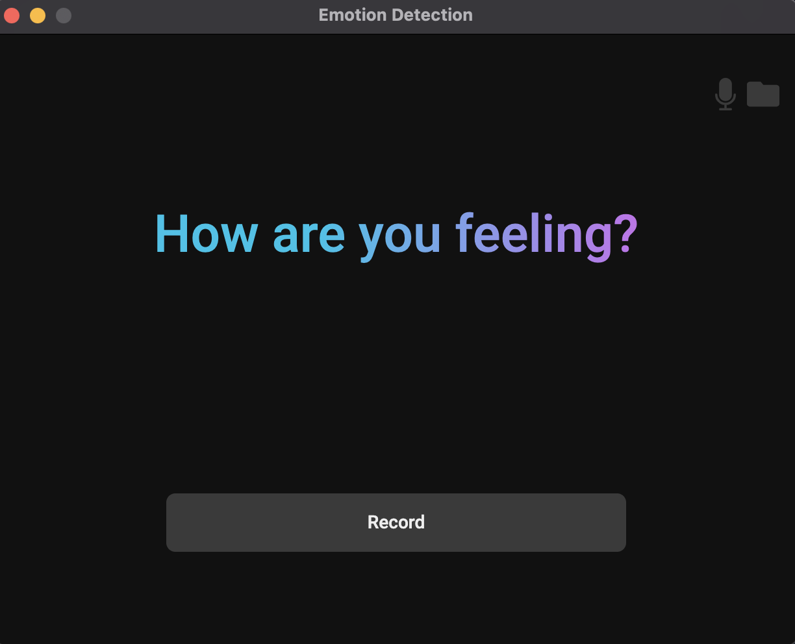

# Python Emotion Detection and Recognition System With Electron GUI

```text
electron
-------->|---------------|   executes 
         |   electron    |-------------> |-------------------|
         | html, css, js |               | python program    |
         |   --------    | >|.wav file|> | --------------    |
         |  > records    |               |  extracts         |
         |  > calls      |               |  features and     |
         |    python     |   emotion     |  classifies       |
         |    script     | <------------ |  emotion          |
         |---------------|               |-------------------|
```

This project contains a simple electron GUI that allows the user to record .wav files. After they are recorded the emotion in them is classified. The Electron shell contains all the interface and recording features. When the Electron shell finishes recording, it immediatly calls a Python script against the .wav file. This Python scripts extracts features from the audio then classifies the emotion using an artificial nueral net.


## Emotion Detection and Recognition System Installation Guide

1. To download and install [electron](https://electron.atom.io) ( OS X or Linux ) you have to download it from [npm-electron](https://www.npmjs.com/package/electron) using :

   ```
   npm install electron --save-dev
   ```
   ```
   npm install -g electron
   ```
   ( if you don't have npm installed use this [link](https://nodejs.org/en/download/) to download it. )

2. If you don't have it alread, install [Python39](https://www.python.org/downloads/). Python3 is used for emotion classification.

3. Install [Anaconda](https://www.anaconda.com/products/individual). Anaconda is an excellent Python3 package manager that will help
   
4. install build tools: https://visualstudio.microsoft.com/visual-cpp-build-tools/

5. restart your computer

6. Open administrative powershell and type `pip3 install misaka`

7. type `conda install pyaudio`

8. type `conda install numba`

9. `conda install librosa` 

10. navigate in PowerShell to the docs folder of the project

11. `conda install --file requirements.txt` if you get errors, try the next step

12. `pip install -r requirements.txt`

13. if you haven't gotten any install errors, naviage to the root of the project

14. `python external_programs\classify.py` the console should classify the file in emotion-detection-system\recordings\

15. You should be set to start classifying through the GUI by launching electron as outlined below


## Execution Guide

1. Open a terminal window and cd to cloned project
   ```
   cd electron-GUI-for-python
   ```

2. Initialize the elcetron aplication (first-time)
   ```
   npm i
   ```

3. Run the electron application
   ```
   npm start
   ```

4. A page should spawn looking as follows:



